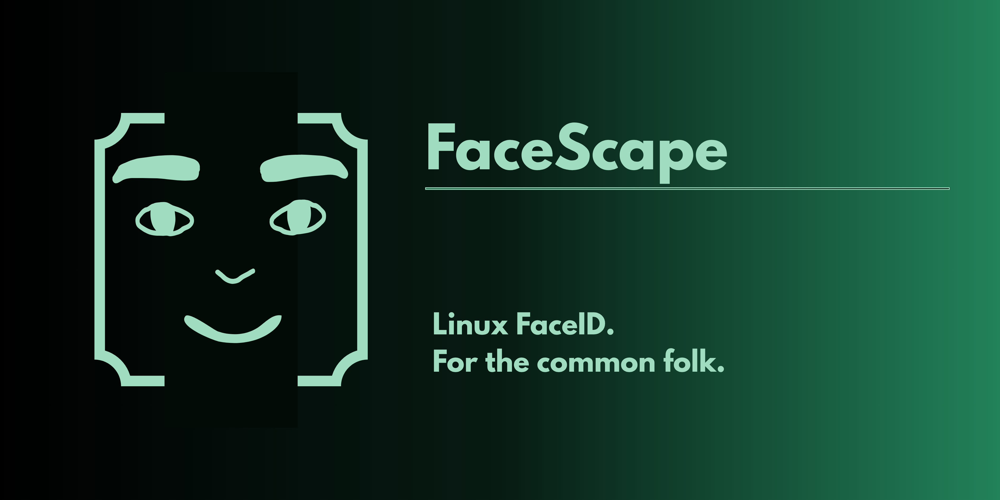

# FaceScape


<p align="center">
    
    
    

----------------------------------------------------

FaceScape is a hardware agnostic facial authentication engine that runs entirely on mathematical algorithms. No ML, no IR hardware, no bullshit.

### Features

- Facial model generation through a frequency embedding pipeline.
- Enrollment and authentication pipelines.
- PAM integration.

### Usage

FaceScape ships with a CLI to enroll new facial models and authenticate against resident models.

```bash
// start facescape. The username can be ommited for operations on the current user.
facescape start {username}

// enroll for some user. 
facescape enroll {username}

// authenticate for some use.
facescape authenticate
```

### Architecture

#### Frame processing

FaceScape utilizes a traditional Visual Computation algorithm pipeline to generate a comprehensive frequency embeddings from frames captured from the webcam.

```text

    [ captured frame ] --> [ Sobel Filter (extract gradient map) ] --> [ 2D Fast Fourier Transformation (frequency embedding) ]
                                                                                                |
                                                                                                |
    [L2 Filter pass (Collapse values to fit between 0.0 and 1.0)] <-- [ Difference of Gaussians (band-pass filter)]
                    |
                    |
    [Extract Fourier Signature Vector (48x48)]

```

#### Model Generation

Each model consists of 30 frequency embeddings aggregated through the median of the values from each, to normalize any broken frames generated by the webcam at capture time (bursted gama, glitches, chromatic aberration, and many other cool artifacts a webcam can generate). On enrollment, 3 models are constructed from the user:

- First model from an average distance.
- Second model closer.
- Third model further away.

An interpolation using SLERP (Spherical Linear Interpolation) is then run between each model to generate two intermediate models between then, and all the values are dumped into a custom .fmodel file using Little Endian bytes to preserve f32 structure.

SLERP is applied in normalized feature space between distance-conditioned embeddings.

#### Authentication

All resident models are loaded from the .fmodel file into an AtomicMatrix SHM arena for quick query. PAM can then call the authentication pipeline from the CLI and generate a partial model from fresh captured frames and run a cosine similarity between all the models in memory. Authentication succeeds if the maximum cosine similarity across enrolled embedding exceeds a defined threshold.

### Design Properties and Threat Model

The algorithms used for model generation aim to provide the following security properties:

- **Resistance to static replay attacks**: The sobel filter for shadow map extraction reduces high fidelity pictures, and 4K videos attack surface against resident models. As flat images generates a different shadow map from real objects, which will produce a different frequency-domain embedding at the end of the pipeline, yielding low cosine similarities with any model. 
- **Software security limitations**: High complexity attacks like high fidelity silicon masks, frame injection attacks, high-fidelity screen replay attacks, and adversarial aligment of frequency spectra are still applicable.
- **Biometric values Reverse Engineering**: Since the frequency embedding acts as a compressed mathematical representation of your facial structure, no relevant biometric value can be extracted from the resident model that can be interpretable as facial geometry. Making the utility of the pipeline one way only.
- **Data Privacy**: FaceScape only register the processed fourier model of your face. No plain pictures are kept, nothing is stored in CNN weights, nothing is shipped out of your device unless you explicitly copy into another drive.

As the early stage of the project, all these claims were tested on a single environment. Therefore, more tests on different deployments are required to prove that the safeties truly holds.

### Disclaimer

FaceScape does not aim to replace other authentication methods (password, fingerprint, smartcards, etc). Therefore, it is recommended to use FaceScape as an alternative logon method alongside others. **DO NOT** replace your entire authentication stack for this software alone, as this could cause a full lock out from your system in case anything goes wrong.

FaceScape also does not aim to be a replacement for IR based facial biometrics, as these two operates on  different Visual Computation fields (2 dimensional image processing to depth analysis), and IR still provides stronger physcial constraints for liveness detection than base 2d approaches because of that. 

FaceScape instead focuses on providing as much robustness as possible for facial authentication using only 2D YUYV input through frequency-domain processing. Providing a practical IR-Free alterative for hardware that does not have it.

FaceScape is still in early stages of development. Therefore, breaking changes must be expected.

### License

This project is licensed under the GNU Affero General Public License v3.0 (AGPLv3).

See full license text: [AGPLv3 license](https://www.gnu.org/licenses/agpl-3.0.txt)
